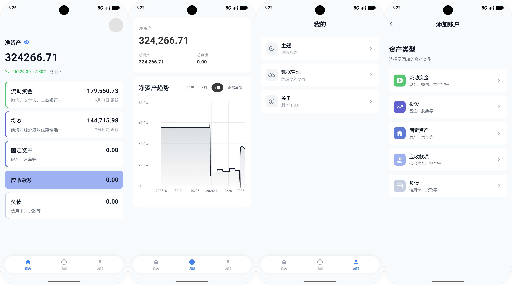

# Monio

一款简洁的开源资产管理应用，帮助你追踪资产、监控基金、洞察净资产趋势。

## 功能特性

- **资产管理** — 支持 5 大资产类别（流动资金、投资、固定资产、应收款项、负债）和 16 个子类型
- **基金追踪** — 获取基金实时估值与历史净值，自动计算收益与收益率
- **净资产趋势** — 记录每日净资产快照，以折线图展示趋势变化，支持 30 天 / 6 月 / 1 年 / 全部年份切换
- **数据导入导出** — Excel 格式导入导出，包含净资产历史、基金数据、其他资产三个 Sheet

## 界面预览



## 技术栈

| 类别         | 技术                                                        |
| ------------ | ----------------------------------------------------------- |
| 框架         | Flutter 3.27+ / Dart 3.0+                                   |
| 状态管理     | Provider                                                    |
| 本地数据库   | SQLite (sqflite)                                            |
| 图表         | fl_chart                                                    |
| 网络请求     | Dio                                                         |
| 数据导入导出 | Excel                                                       |
| 基金数据源   | [real-time-fund](https://github.com/hzm0321/real-time-fund) |

### 环境要求

- Flutter SDK >= 3.27
- Dart SDK >= 3.0
- Android NDK 27.0.12077973
- JDK 17

### 安装依赖

```bash
flutter pub get
```

### 运行

项目配置了 `dev` 和 `prod` 两个 flavor，运行时必须指定：

```bash
# 开发环境
flutter run --flavor dev

# 生产环境
flutter run --flavor prod
```

### 构建

```bash
# Debug APK
flutter build apk --debug --flavor dev

# Release APK
flutter build apk --release --flavor prod
```

APK 输出路径：`build/app/outputs/flutter-apk/`

## 数据库

应用使用 SQLite 本地存储，包含 3 张表：

| 表名                | 说明                                           |
| ------------------- | ---------------------------------------------- |
| `accounts`          | 资产账户（含基金专属字段）                     |
| `net_worth_history` | 净资产历史快照（保留近 1 年明细 + 历史年汇总） |
| `fund_nav_history`  | 基金净值变动记录（保留近 30 天）               |
